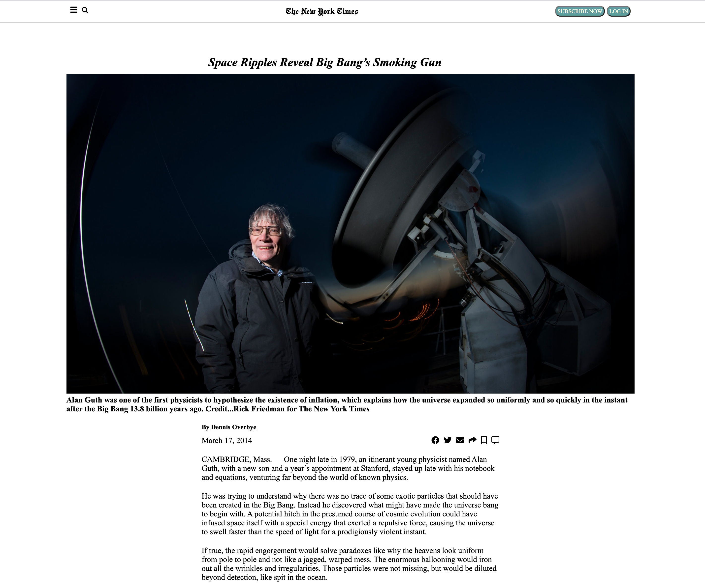

# Project Name

> We created a clone of a The New York Times article webpage. 

## Built With

- HTML
- CSS

## Live Demo

[Live Demo Link](https://raw.githack.com/gurbuzertunga/nytimesclone/feature/index.html)

## Authors

👤 **Daniel Ronan**

- Github: [@DcRonan](https://github.com/DcRonan)
- Linkedin: [Daniel Ronan](https://www.linkedin.com/in/danronan10/)

👤 **Coding Parter**

- Github: [gurbuzrtunga](https://github.com/gurbuzertunga)
- Linkedin: [linkedin](https://www.linkedin.com/in/gurbuz-ertunga-a607a2a5)

## 🤝 Contributing

Contributions, issues and feature requests are welcome!

Feel free to check the [issues page](enter issues url here).

## Show your support

Give a ⭐️ if you like this project!x

## 📝 License

This project is [MIT](lic.url) licensed.